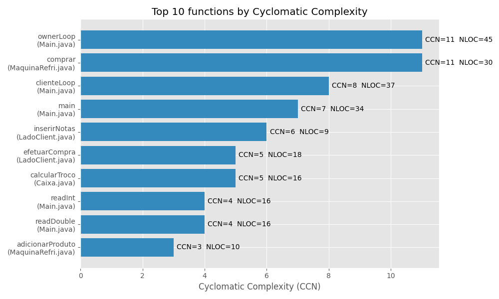

# software-quality-tads-06

## Testes

Adicionei testes básicos em `src/test/java/MaquinaRefriTest.java` (JUnit 5). O repositório não tem um gerenciador de build por padrão. Para executar os testes você pode:


## Complexity metrics

Generated cyclomatic complexity metrics (McCabe/CCN) using `lizard` and a small plotting script. The top-10 functions by CCN are shown below.



Parsed metrics are available in `tools/METRICS_parsed.json` and the raw `lizard` output is in `METRICS.json`.

## Testes

Adicionei testes básicos em `src/test/java/MaquinaRefriTest.java` (JUnit 5). O repositório não tem um gerenciador de build por padrão. Para executar os testes você pode:


Este repositório contém uma implementação de uma máquina de refrigerantes com duas interfaces (cliente/proprietário), suporte a várias cédulas/moedas e um conjunto de testes JUnit. Abaixo está um tutorial completo para executar o projeto, executar os testes e gerar métricas de complexidade (ênfase na complexidade ciclomática de McCabe).

## Pré-requisitos

- Java JDK 11 ou superior
- Maven (opcional — usado para construir e testar facilmente)
- Python 3.8+ (recomendado 3.11), para gerar as métricas e produzir gráficos

## Rodar o projeto

Opções principais:

1) Usando Maven (recomendado se você tiver o `pom.xml` configurado):

```bash
# construir o jar e executar os testes
mvn clean package

# executar a aplicação (jar gerado em target/)
java -jar target/*.jar
```

2) Usando sua IDE

- Importe como um projeto Java e execute `app.Main` (classe `app.Main` contém a CLI).

3) Executando diretamente com o jar gerado

- Se já houver um JAR em `target/`, execute `java -jar target/seu-artifact.jar`.

## Executar os testes

Os testes unitários usam JUnit 5 e estão em `src/test/java`.

Com Maven:

```bash
mvn test
```

Ou execute os testes pela sua IDE (Run tests / Run as JUnit tests).

## Gerar métricas de complexidade (McCabe) — passo a passo

Este repositório inclui um pequeno pipeline para gerar métricas de complexidade e um gráfico com as 10 funções/métodos de maior complexidade.

1) Criar e ativar um ambiente Python (recomendado):

```bash
# no diretório do projeto
python -m venv .venv
source .venv/bin/activate
```

2) Instalar as dependências Python necessárias (lizard para métricas; matplotlib para o gráfico):

```bash
python -m pip install --upgrade pip
python -m pip install lizard matplotlib
```

3) Executar o lizard para analisar o código Java e salvar o relatório (o `-o` produz saída que o script de plotagem espera):

```bash
# gera METRICS.json na raiz do repositório
python -m lizard -l java -o METRICS.json src/main/java
```

4) Gerar o gráfico (o projeto já inclui `tools/plot_lizard.py`):

```bash
python tools/plot_lizard.py
# gera: tools/METRICS_parsed.json e tools/complexity_top10.png
```

Os arquivos gerados são:
- `METRICS.json` — saída do lizard (texto tabular salvo com extensão .json)
- `tools/METRICS_parsed.json` — a versão parseada que o script produz
- `tools/complexity_top10.png` — gráfico das 10 funções com maior CCN

Se preferir automatizar sem criar um venv manualmente, use `python -m pip install --user lizard matplotlib` e execute os comandos acima com `python` do seu sistema.

## O que é cada sigla / métrica

- CCN (Cyclomatic Complexity Number) / McCabe: número de caminhos linearmente independentes através do código — mede complexidade de controle. Quanto maior o CCN, maior a complexidade e maior a dificuldade de testar e manter. (Lizard chama isto de cyclomatic_complexity.)

- NLOC (Non-Comment Lines): número de linhas de código (não comentadas) dentro da função/método.

- token: número aproximado de tokens/elementos léxicos na função; indica densidade sintática.

- PARAM (parameter count): número de parâmetros da função/método.

- length: comprimento em linhas da função (similar a NLOC neste contexto).

Interpretação rápida:
- CCN <= 5: geralmente simples
- 6 <= CCN <= 10: atenção — começa a ficar mais complexo
- 11 <= CCN <= 15: candidato a refatoração (dividir função, reduzir aninhamento)
- CCN > 15: altamente complexo — recomenda-se refatorar urgentemente

Estas são diretrizes; contexto e necessidades do projeto podem justificar valores diferentes.

## Como interpretar o gráfico `tools/complexity_top10.png`

- Cada barra representa uma função/método com seu CCN. Funções no topo (maior CCN) são as mais complexas.
- Ao ver uma função com CCN alto, procure:
	- reduzir branches (if/else, switch)
	- usar early returns/guard clauses
	- extrair subtarefas em funções menores
	- reduzir número de parâmetros (PARAM)

## Integração em CI (sugestão)

- Adicione um job que execute `python -m lizard -l java -o METRICS.json src/main/java` e falhe se houver funções com CCN acima de um limiar aceitável (ex.: 15). Lizard tem opções de threshold (`-C`) e saída em XML/CSV para integração.

## Observações finais

- O projeto já contém um script de plotagem (`tools/plot_lizard.py`) que espera a saída do lizard salvo em `METRICS.json` e gera o gráfico em `tools/complexity_top10.png`.
- Se preferir, eu posso ajustar o pipeline para gerar JSON/CSV diretamente do lizard (usando extensões) ou adicionar um Makefile/Maven goal para automatizar tudo.

Se quiser, eu atualizo o README com um badge que mostra o CCN máximo atual ou adiciono um job de CI que falha quando o CCN exceder um limite.
